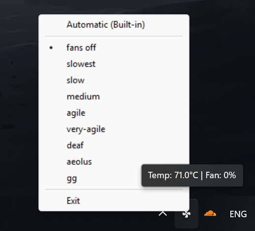

# Framework Fan Control for Windows

This is a Windows port of the original `fw-fanctrl` project, providing a simple and powerful way to manage your Framework Laptop's fan behavior. It runs as a clean, standalone tray application.

This fork finishes wzqvip's **[project](https://github.com/wzqvip/fw-fanctrl-windows)** because they stopped development.

## Features

*   **System Tray Control:** Runs silently in the system tray. Right-click the icon to get a full menu of fan modes.
*   **Customizable Fan Curves:** All fan strategies are defined in a simple `config.json` file. You can easily edit them or add your own, from completely silent to full performance. (then recompile)
*   **Automatic Mode:** The "Automatic (Built-in)" option instantly and reliably hands fan control back to the laptop's default firmware.
*   **Remembers Your Last Setting:** The application saves your last used strategy (including "Automatic") and loads it the next time it starts.
*   **Safe by Design:** Automatically restores the default system fan control when the application is closed, ensuring your laptop is never left without proper thermal management.

## Compatibility

*   **Laptops:** Framework Laptop 13 and 16 (All variants, Intel and AMD) (should hopefully? only tested on fw16)
*   **Operating System:** Windows 10 (64-bit) and Windows 11 (64-bit) (only tested on win11 so far)

## Installation & Usage

Make sure test signing is enabled (which requires secure boot to be disabled)
bcdedit /set {default} testsigning on

1.  Go to the **Releases** page of this repository.
2.  Download the latest `Framework-Fan-Control.exe` from the "Assets" section.
3.  Double-click the `.exe` to run it. Windows will ask for **Administrator permission**, which is required for the application to control the hardware fans.
4.  A new fan icon will appear in your system tray. **Right-click the icon** to select your desired fan mode. Please be patient, as it may take a few seconds for a new curve to apply.

## Configuration

You can fully customize the fan behavior by editing the `config.json` file with a text editor.

*   `"defaultStrategy"`: The name of the fan curve that will be loaded by default when the application first runs.
*   `"strategies"`: A list of all available fan curves. You can edit the `speedCurve` points for any strategy or create entirely new ones. Each point maps a `temp` (in Celsius) to a fan `speed` (in percent).

## Future Plans

*   Improve the user interface.
*   Add support for creating and saving custom fan curves directly from the UI.
*   Include a built-in option to have the application launch on startup.

## Acknowledgements & Licensing

This project would not be possible without the foundational work of others.

*   This project is a completion of the **[fw-fanctrl-windows](https://github.com/wzqvip/fw-fanctrl-windows)** started by **wzqvip**.
*   The original concept and fan logic is based on **[fw-fanctrl](https://github.com/TamtamHero/fw-fanctrl)** by **TamtamHero**.
*   Hardware communication is handled by **[ectool](https://github.com/DHowett/FrameworkWindowsUtils)** by **DHowett**.
*   Temperature sensing is provided by the **[LibreHardwareMonitor](https://github.com/LibreHardwareMonitor/LibreHardwareMonitor)** library, which is licensed under the Mozilla Public License 2.0.

This application is distributed under the **MIT License**.

## Disclaimer

This software modifies your laptop's fan control system. Use it at your own risk. While it is designed to be safe, the author is not responsible for any potential damage to your hardware.
